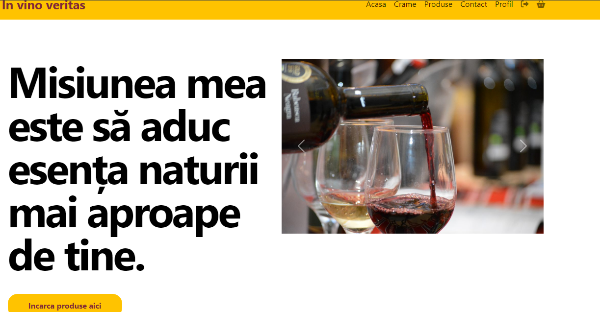
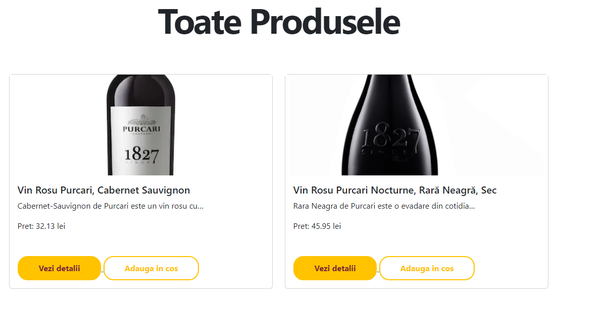
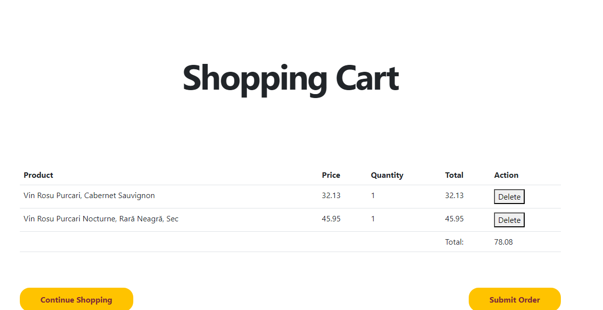

Aplicatia pe care am dezvoltat-o este o aplicatie web folosita pentru gestionarea unui marketplace
axat pe vinuri. Este o aplicatie web construita folosind framework-ul Django in limbajul de programare Python.

1. Descriere
   Folosind aceasta aplciatie utilizatorii pot efectua diverse actiuni precum inregistrarea de crame, vizualizarea 
   si cautarea cramelor in functie de diferite criterii, adaugarea de vinuri la cosul de cumparaturi, 
   gestionarea profilului.
2. Screenshots Wine Marketplace
   Home Page
 
   Pagina produse
 
 Pagina cos cumparaturi
 
 Pagina crame
 
3. Download repository si instalare
   Se cloneaza acest repository local in folderul cu proiecte Python cu comanda:
   git clone https://github.com/chiriacmihai93/wine_marketplace.git
   Pentru a instala dependentele, ruleaza:
   pip install -r requirements.txt 

   
