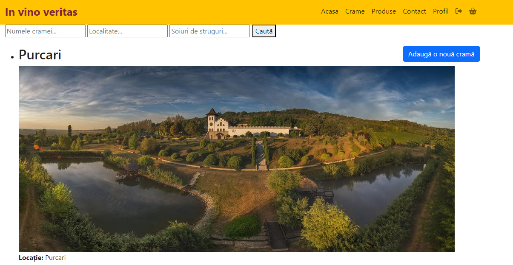

Aplicatia pe care am dezvoltat-o este o aplicatie web folosita pentru gestionarea unui marketplace
axat pe vinuri. Este o aplicatie web construita folosind framework-ul Django in limbajul de programare Python.

1. Descriere
   Folosind aceasta aplciatie utilizatorii pot efectua diverse actiuni precum inregistrarea de crame, vizualizarea 
   si cautarea cramelor in functie de diferite criterii, adaugarea de vinuri la cosul de cumparaturi, 
   gestionarea profilului.
2. Screenshots Wine Marketplace
   Home Page
 
   Pagina produse
 
 Pagina cos cumparaturi
 
 Pagina crame
 
3. Download repository si instalare
   Se cloneaza acest repository local in folderul cu proiecte Python cu comanda:
   git clone https://github.com/chiriacmihai93/wine_marketplace.git
   Pentru a instala dependentele, ruleaza:
   pip install -r requirements.txt 
4. Dezvoltare unui proiect folosind framework-ul Django
Instalare framework Django - va trebui sa va asigurati ca aveti instalat acest framework si sa rulati comanda de mai jos
pip install django

Creare proiect folosind Django - cand creati un proiect va trebui sa folositi terminalul si sa rulati comanda de mai jos
django-admin startproject nume_proiect

Crearea unei aplicatiei - inainte de a crea aplicatia va trebui sa mergeti in directorul proiectului folosind comanda
cd nume_proiect, apoi veti rula comanda de mai jos in terminal
python manage.py startapp nume_aplicatie

Dupa ce creem aplicatia mergem in fisierul settings.py sa face setarile aplicatiei si sa denumim baza de date
Definirea modelelor - dupa ce definim modelele structurii bazei de date in fisierul models.py vom rula urmatoarea comanda
python manage.py makemigrations

python manage.py migrate

Rularea aplicatiei se va face folosind comanda de mai jos
python manage.py runserver

Creare superuser - acesta ne va ajuta sa avem acces la interfata Django admin
python manage.py createsuperuser
   